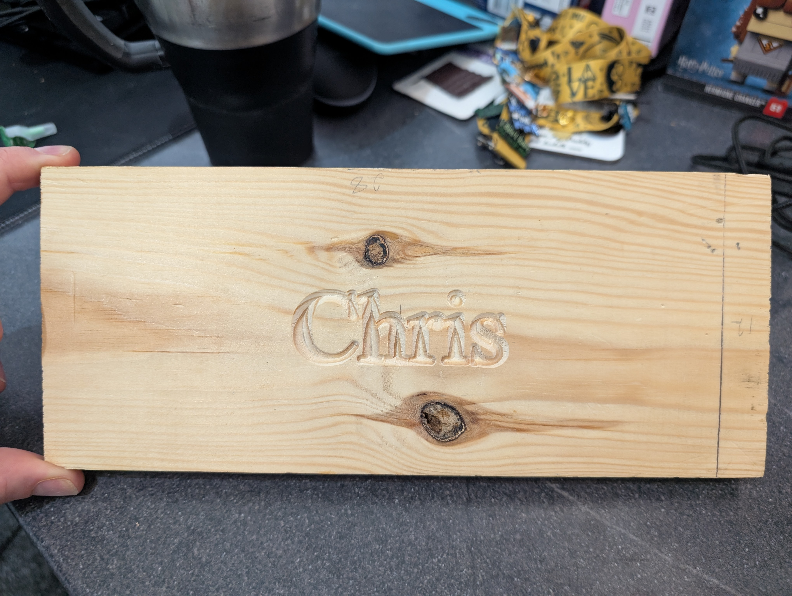
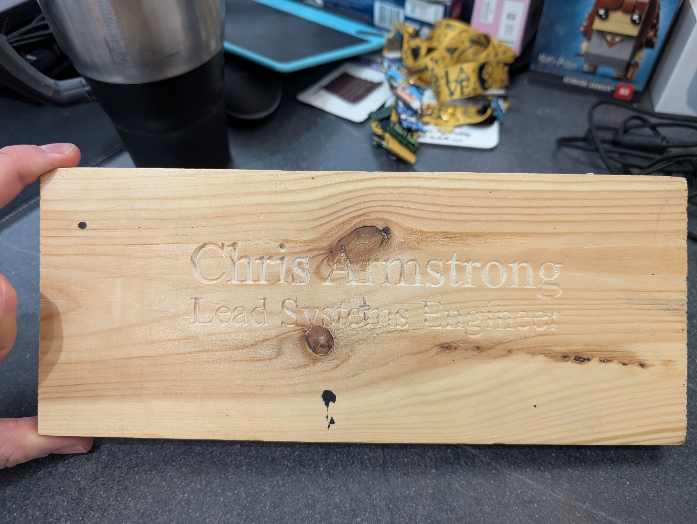

# My Desk Name Sign

I have access to a CNC machine at my men's shed. I am a member of the [Westhill Men's Shed](https://westhillmensshed.co.uk/) and I have started to try and learn how to use our Genmitsu 6050 XL CNC. I was able to start my very first CNC project on the 30th May 2025 which was a simple job of just engraving my name 'Chris'. The Shed had just bought a brand new computer for driving the CNC and we were using this to help test out getting the CNC and the computer set up. 

After the most rudimentary start, we then quickly started working on a desk name sign by including my full name and job title

Now I want to try and do a better job now that I'm starting to use the CNC machine. First of all I started pouring over Google Images for some inspiration ...

In this section, I should elaborate and describe my project.

The inspiration for this project was ... 

And this is a preview of what my design looks like:

# 

# Project File

## CNC Software

This project file was built using Vectric VCarve Desktop Trial Edition v12.011.

## Endmills

This project is based on the following endmills:

1. TBD

2. TBD

## Toolpaths

This product is completed in three operations:

1. List out the names of the tool paths and briefly explain the difference / objective of each one

## Maching Time

VCarve Pro estimated a total machining time of approximately TBD hrs / mins.
